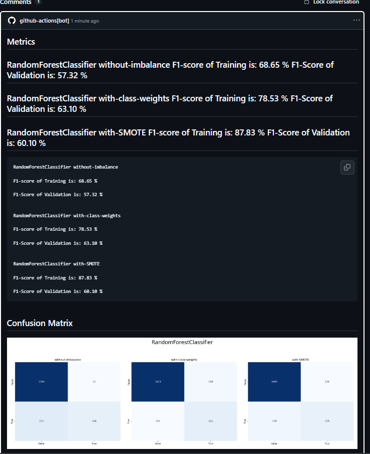
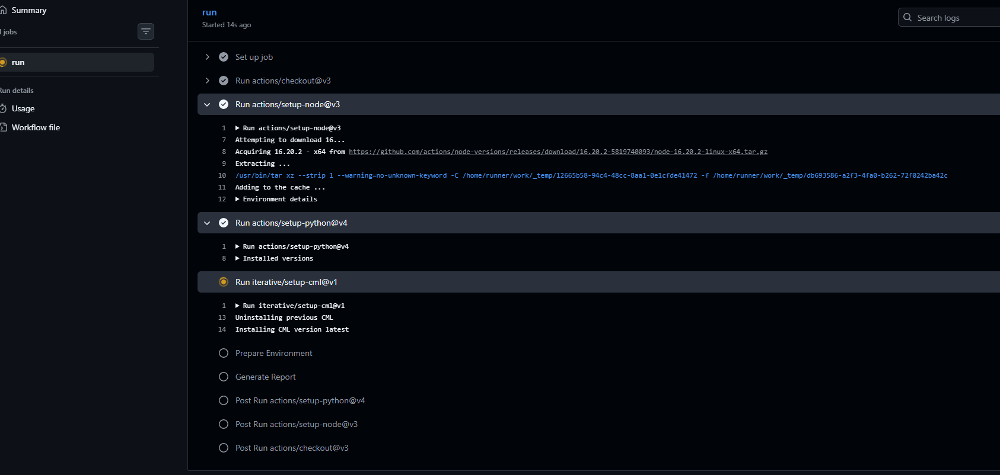
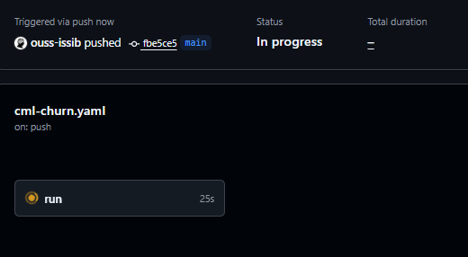
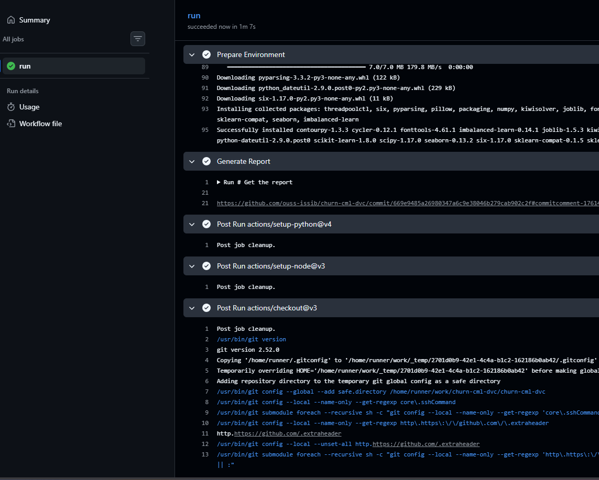

# Atelier 3 -- CI/CD pour le Machine Learning (CML)

Projet pédagogique : **churn-cml-dvc**\
Reporting automatique des métriques ML avec **GitHub Actions + CML**

------------------------------------------------------------------------

## 🎯 Objectif de l'atelier

Cet atelier met en place une première brique MLOps côté GitHub :

-   Exécuter l'entraînement du modèle ML à chaque `git push`
-   Générer automatiquement les métriques (`metrics.txt`)
-   Générer la matrice de confusion (`conf_matrix.png`)
-   Publier un rapport lisible en commentaire GitHub grâce à **CML**

------------------------------------------------------------------------

## 📁 Structure minimale du dépôt

``` bash
churn-cml-dvc/
│── dataset.csv
│── script.py
│── requirements.txt
└── .github/
    └── workflows/
        └── cml-churn.yaml
```

------------------------------------------------------------------------

## 🧰 Prérequis techniques

### Côté local

-   Un compte GitHub\
-   Git installé\
-   Python 3.11\
-   Un projet ML contenant :
    -   `dataset.csv`
    -   `script.py`
    -   `requirements.txt`
    -   `.github/workflows/cml-churn.yaml`

### Côté GitHub

-   Dépôt GitHub (public ou privé)
-   GitHub Actions activé
-   Utilisation du token automatique : `${{ secrets.GITHUB_TOKEN }}`

------------------------------------------------------------------------

## 🧠 Rôle de `script.py`

1.  Charger `dataset.csv`\
2.  Nettoyer les données\
3.  Séparer train / test\
4.  Encoder les variables catégorielles\
5.  Normaliser les variables numériques\
6.  Gérer le déséquilibre des classes (class weights / SMOTE)\
7.  Entraîner un modèle (ex: RandomForest)\
8.  Calculer les métriques (F1-score, etc.)\
9.  Générer `conf_matrix.png`\
10. Écrire un résumé clair dans `metrics.txt`

------------------------------------------------------------------------

## 📦 Rôle de `requirements.txt`

-   numpy\
-   scipy\
-   pandas\
-   matplotlib\
-   seaborn\
-   scikit-learn\
-   imbalanced-learn\
-   joblib

------------------------------------------------------------------------

## 🚀 Pipeline GitHub Actions + CML

-   Déclenchement à chaque `push`
-   Installation Node + CML
-   Installation Python 3.11 + dépendances
-   Exécution de `script.py`
-   Génération de `report.md`
-   Publication avec **CML**

------------------------------------------------------------------------

## 🔄 Déroulement après un `git push`

1.  Démarrage du runner Ubuntu\
2.  Installation des dépendances\
3.  Entraînement du modèle\
4.  Génération de `metrics.txt` et `conf_matrix.png`\
5.  Création de `report.md`\
6.  Publication automatique dans GitHub

------------------------------------------------------------------------

## 📊 Résultat attendu

-   Commentaire GitHub avec métriques\
-   Image de la matrice de confusion

------------------------------------------------------------------------
## 🧪 Captures d'écran

| Graph Report | Merged | Rapport |
|---|---|---|
|  |  |  |

| Pending | Report from Gmail | Run |
|---|---|---|
|  |  |  |

| Termined |  |  |
|---|---|---|
|  |  |  |

------------------------------------------------------------------------

## 📝 Résumé

-   Entraînement ML automatisé\
-   Génération automatique des métriques\
-   Publication automatique du rapport\
-   Feedback continu sur GitHub\
-   Traçabilité des performances du modèle
